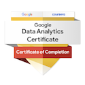
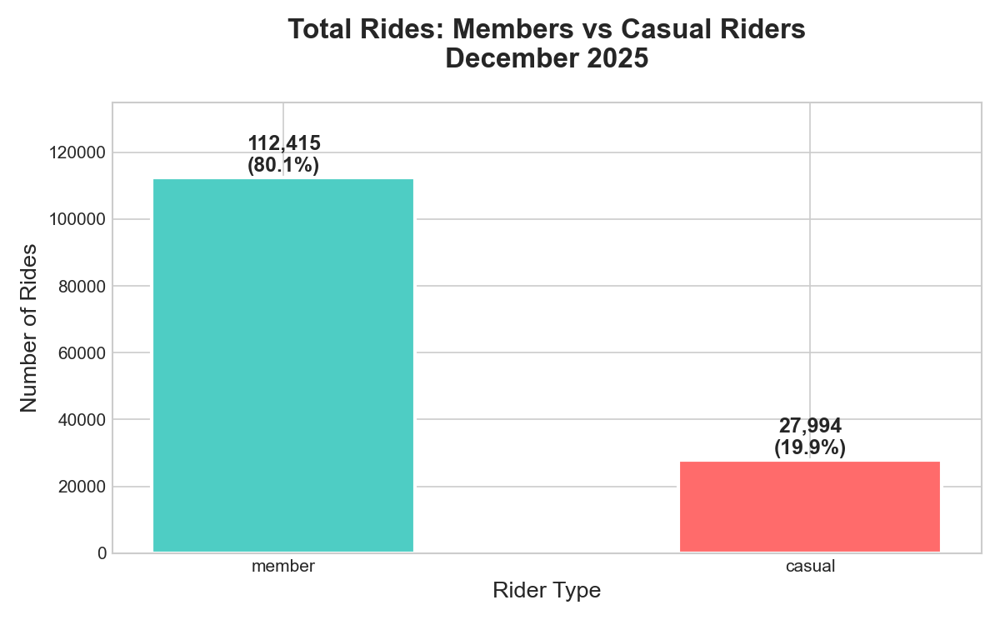
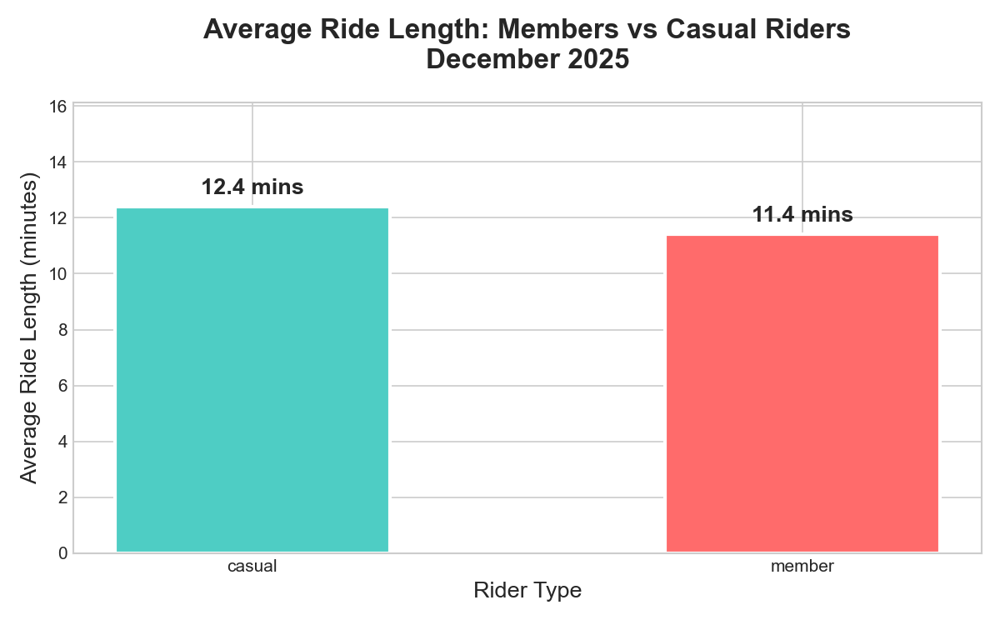
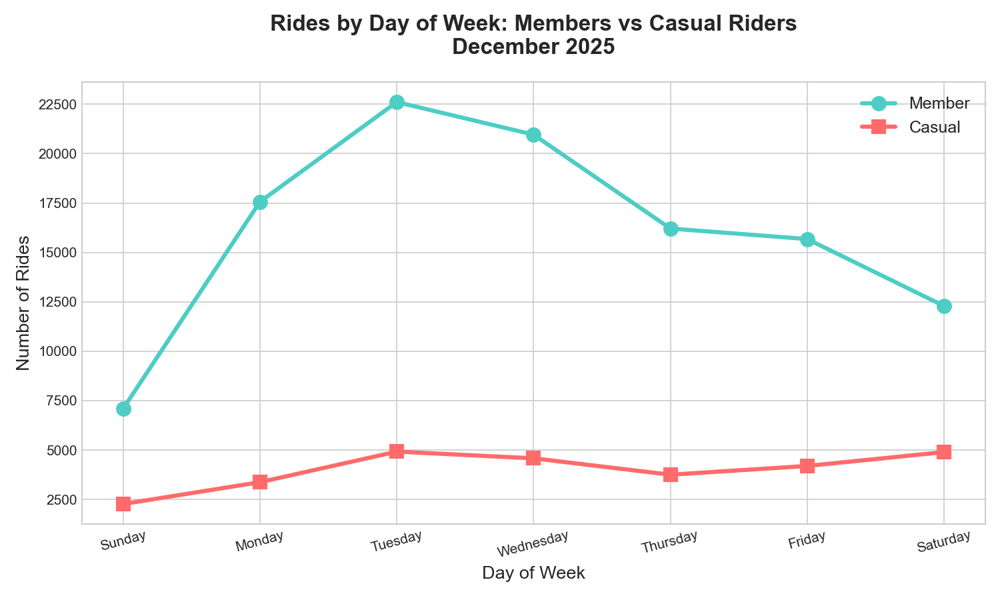
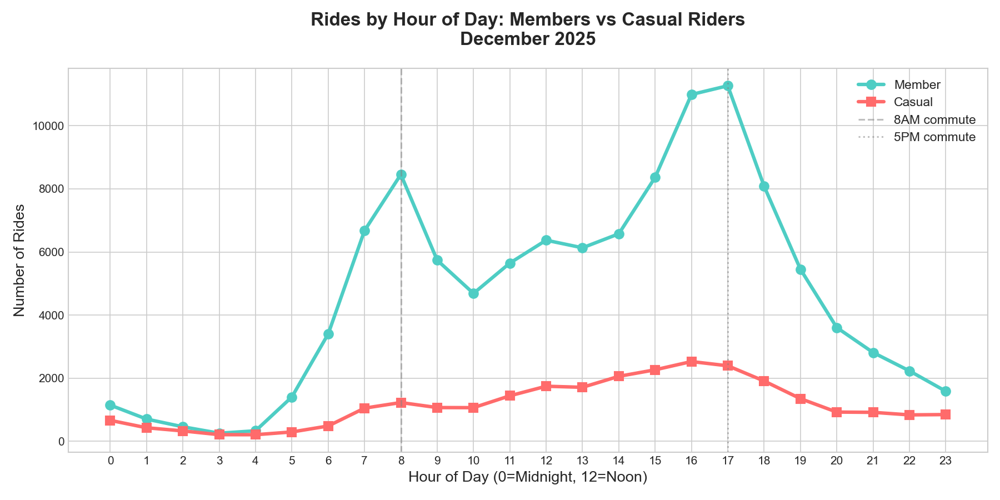
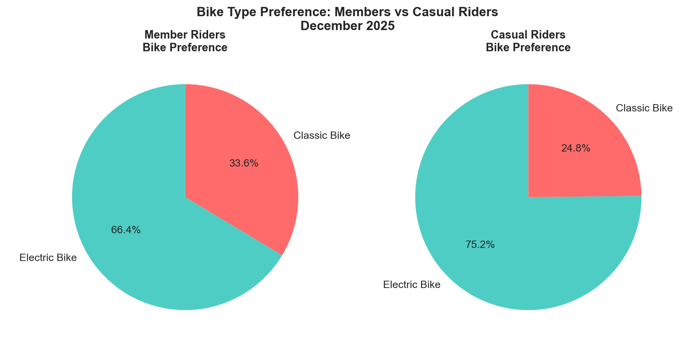

<table>
  <tr>
    <td style="width: 70%;">
      <h1> Cyclistic Bike-Share Analysis</h1>
      <h3>Google Data Analytics Professional Certificate — Capstone Project</h3>
    </td>
    <td style="width: 30%;">
      
    </td>
  </tr>
</table>

---

## 📋 Project Overview
As a junior data analyst at Cyclistic (a fictional bike-share 
company in Chicago), I was tasked with analyzing how 
**casual riders** and **annual members** use Cyclistic bikes 
differently — to help the marketing team convert casual 
riders into annual members.

---

## ❓ Business Question
> *"How do annual members and casual riders use 
> Cyclistic bikes differently?"*

---

## 🛠️ Tools Used
| Tool | Purpose |
|---|---|
| Python (Pandas) | Data cleaning & analysis |
| MySQL | SQL queries & database |
| Power BI | Interactive dashboard |
| Matplotlib/Seaborn | Data visualizations |
| VS Code | Development environment |

---

## 📊 Key Findings

| Metric | Casual Riders | Members |
|---|---|---|
| Total Rides | 27,994 (20%) | 112,415 (80%) |
| Avg Ride Length | ~22 mins | ~9 mins |
| Busiest Day | Weekend | Weekday |
| Peak Hour | 3PM | 8AM & 5PM |
| Bike Preference | Electric | Electric |
| Riding Purpose | Leisure | Commute |

---

## 📈 Visualizations

### Total Rides by Rider Type

### Average Ride Length

### Rides by Day of Week

### Rides by Hour of Day

### Bike Type Preference

---

## 🏆 Top 3 Recommendations

### 🥇 Recommendation 1 — Weekend Membership Promotion
- Casual riders peak on **Saturday & Sunday**
- Offer discounted annual membership upgrade on weekends
- Message: *"You already ride weekends — save money 
  with an annual membership!"*

### 🥈 Recommendation 2 — Ride Duration Rewards Program
- Casuals take **longer rides** (leisure focused)
- Create rewards: *"Ride 20+ mins as member = earn points"*
- Appeals directly to their existing riding behavior!

### 🥉 Recommendation 3 — Digital Ads at Peak Casual Hours
- Casuals ride most between **11AM — 3PM on weekends**
- Run targeted social media ads during these exact hours
- Show cost savings of annual membership vs per-ride pricing

## 🔄 Data Analysis Process
Following the Google Data Analytics framework:

- ✅ **Ask** — Defined business task and stakeholders
- ✅ **Prepare** — Downloaded and understood the data
- ✅ **Process** — Cleaned data using Python/Pandas
- ✅ **Analyze** — Found patterns using Python and SQL
- ✅ **Share** — Created visualizations and Power BI dashboard
- ✅ **Act** — Provided top 3 actionable recommendations

## 🎓 Certification

> ✅ Issued by **Google** via **Coursera** — June 2026
---

## 📬 Connect With Me
- LinkedIn: www.linkedin.com/in/priyanka-mishra-data-analyst
- Email: priyankaofficial010@gmail.com
